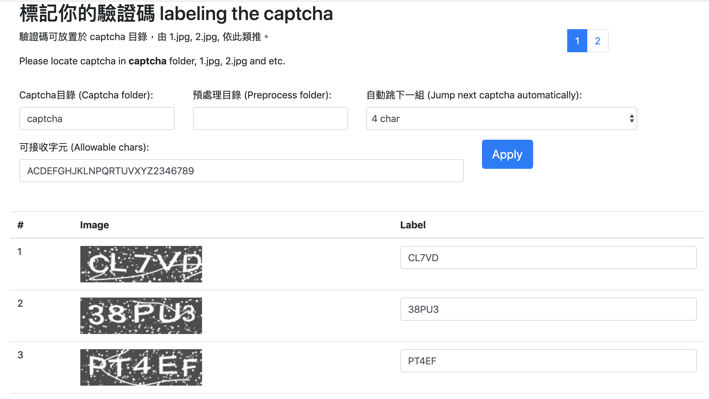
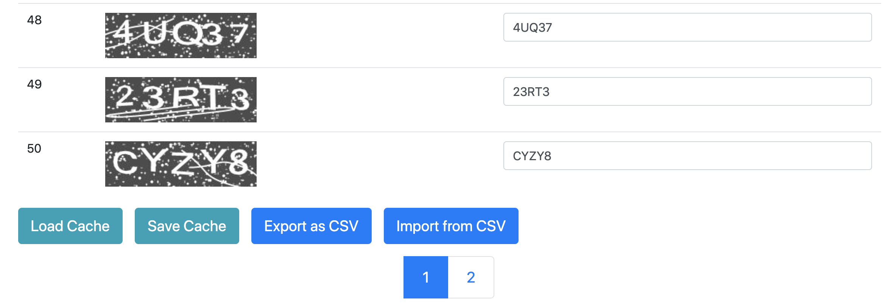

# 標註您的驗證碼 (中文)

找了一些開源的標註驗證碼工具，發現有些工具還需處理跨平台問題。於是乾脆寫了一個網頁，可以直接用瀏覽器開啟，並且下載 csv 標註檔。

每 60 秒會自動儲存目前頁面到瀏覽器的 localStorage 為 cache。當整個完成時，就可以按 `Export as CSV` 按鈕下載 csv 標註檔。

# Label the captcha (English)

I've found some open-source label captcha tool, but it took me a lots of time to install on different OS platforms. I wrote a html website, you can open it with browser and start to label. After completing above steps, you can download this csv file.

The page will be saved to browser localStorage as cache every 60 seconds. When completing all labeling, just click `Export as CSV` button to download csv file.

# 截圖 (Screenshot)

Screenshot 1

Screenshot 2

